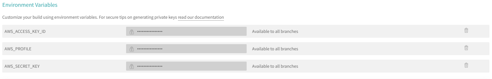
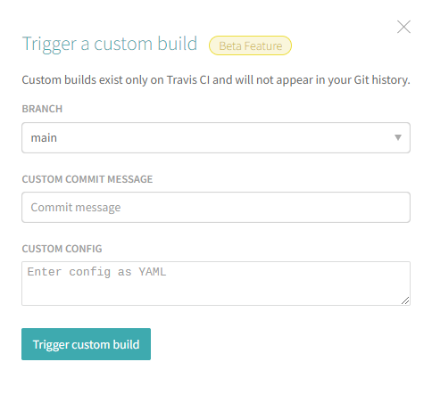
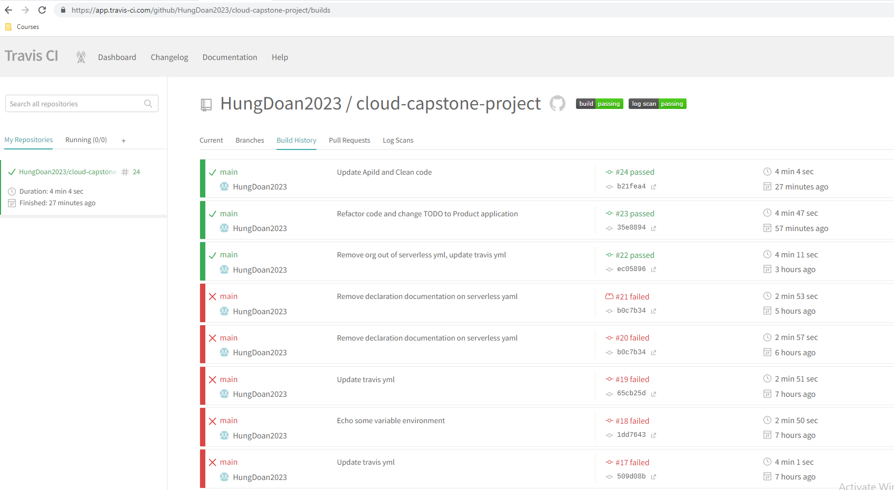
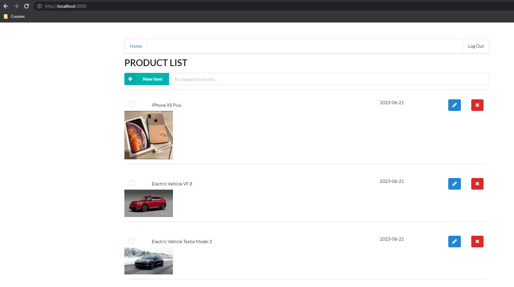

# Cloud Capstone Project
In this project, I have based on the Serverless project to enhancement some taks below:
* Improve CI/CD with Travis CI
* Convert `TODO` application to `Product Mangement` applicaton with some functionality such CRUDS (Create, Update, Remove, Select) product in the list.

### Steps for Building & Deployment the Product Management Application
1. Clone source code from project 04 [https://github.com/HungDoan2023/the-serverless-todo-app.git](https://github.com/HungDoan2023/the-serverless-todo-app.git)

2. Clean up the code and create a `.travis.yml` as below
* Create content of `.travis`
```
language: node_js
node_js:
- 16

install:
- echo "Installing serverless, library"
- npm install serverless --save-dev --force
- npm install --save-dev --force

before_install:
- echo "Jump into backend directory"
- cd backend

script:
- echo "Running scripts..."
- npm install serverless-webpack --save-dev --force
- npm install serverless-iam-roles-per-function --save-dev
- npm install serverless-plugin-tracing --save-dev
- npm install serverless-aws-documentation --save-dev

- echo "Setting credentials..."
- serverless config credentials --provider aws --key ${AWS_ACCESS_KEY_ID} --secret ${AWS_SECRET_KEY} --profile ${AWS_PROFILE}

- echo "Exporting variable environment..."
- export NODE_OPTIONS=--max_old_space_size=4096

- echo "Deploying..."
- serverless deploy --aws-profile $AWS_PROFILE

after_success:
- echo "Finish setting dev environment"

```
* Create Variable Environment on Travis CI 
  <br>

* Trigger Build on Travis CI
  <br>


3. Try to do and test unstil build/deploy successfull
<br>

4. Convert `TODO` application to `Product Management` application
* Update backend, frontend and serverless yml file

5. Setting environment
* Please read the README at [https://github.com/HungDoan2023/the-serverless-todo-app#readme](https://github.com/HungDoan2023/the-serverless-todo-app#readme)<br>

6. Demo ( Create some new product and upload images with it)


